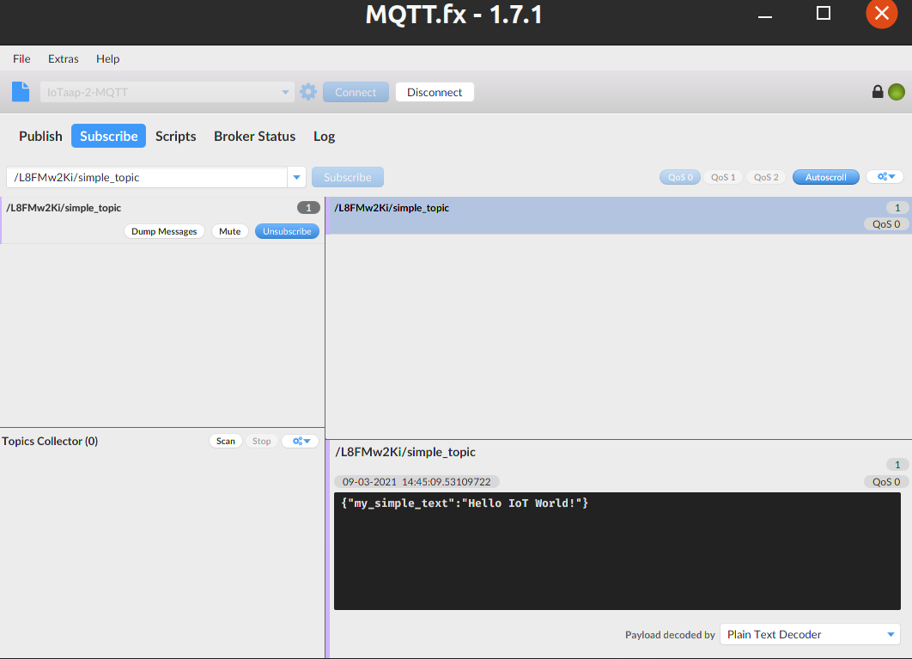
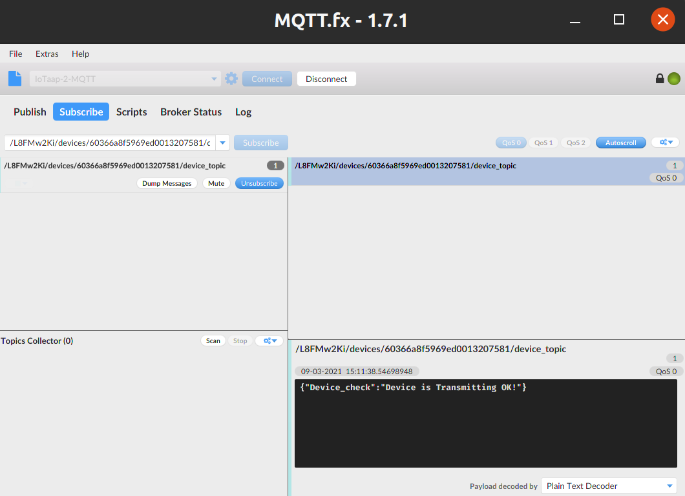
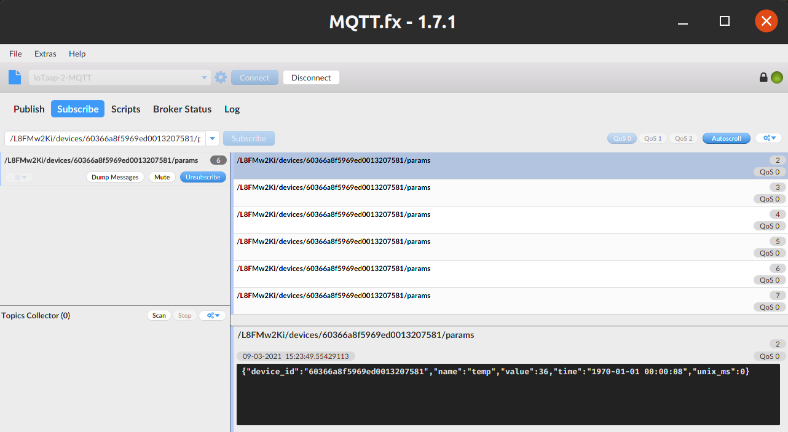
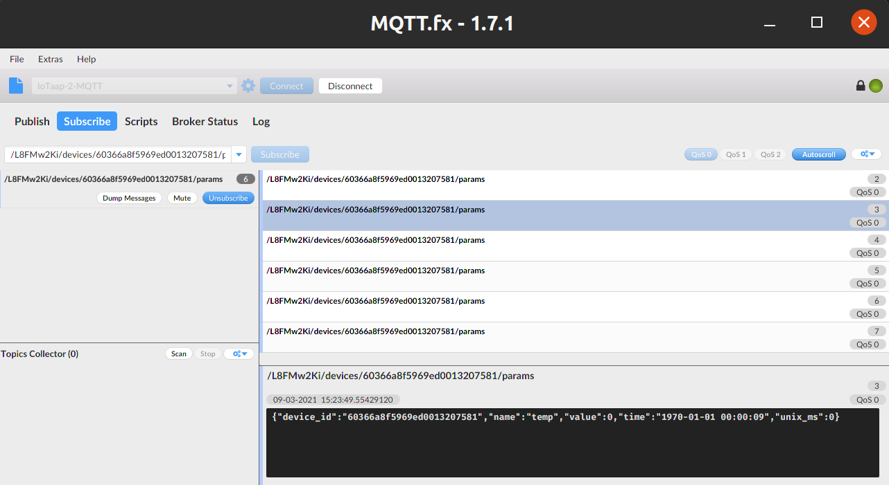
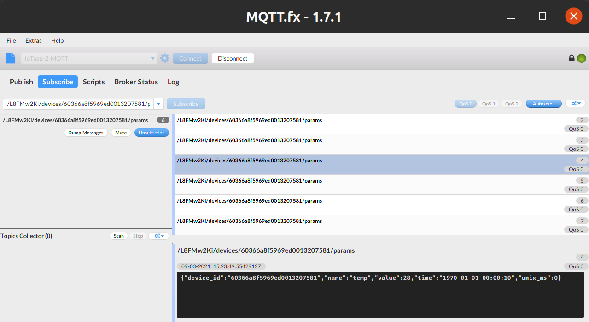

# Publishing

Publishing in MQTT is the action of creating a message and then sending that message through a MQTT broker to all subscribers of a topic.
This is similar to how local News channels only show news relevant to your area. The broker understands who is subscribed to a topic and will only share with those devices. To better understand subscription please [read subscription tutorial](iotaap-os-mqtts-basics-subscribing.md).

There is multiple ways to publish supported within IoTaaP OS. This tutorial on publishing will walk through each in depth. The direct API can be found in the [docs](https://docs.iotaap.io/docs-iotaap-os/functions/#int-basiccloudpublish)


To publish data in IoTaaP we use JSON as the universal message format.

## JSON

JavaScript Object Notation allows us to pass information in an easily machine-readable format.
JSON is a international standard used for its simplicity. JSON is in essence a list of paired values.

Normally the first value is a category, with the second being the value.

`{"category" : "value" }`

JSON can also have multiple pairs of values within an object.

```cpp
{
    "category_1" : "value_1",
    "category_2" : "value_2",
    "category_3" : "value_3"
}
```
To parse data into JSON format we suggest including the [Arduino JSON library](https://arduinojson.org/) to parse data into JSON format.

This can be achieved by adding `ArduinoJson` to the Lib_deps within the platformio.ini file within the project.

```
lib_deps = 
    iotaap/IoTaaP OS @ ^3.0.2 
    arduinoJson
```
First we need to include the ArduinoJson library within our main.cpp.
`#include <ArduinoJson.h>` is added to the top.

Followed by declaring an JSONDocument object with a 200 item capacity.
```cpp
StaticJsonDocument<200> jdoc;
```

Next we need a Char Array of suitable size to hold our JSON Object.
```cpp
char json_char[256];
```

Within the loop we need to add our parameters into the json document.
```cpp
jdoc["date"]= "2020-01-01";
jdoc["time"]="00:01:01";
```
There is several formats which can be used. More details can be found within [arduinoJson Docs](https://arduinojson.org/v6/doc/serialization/).

Finally we can use the "serialize" command from the arduinoJson library to convert this JSON doc into a char array in json format.

```cpp
serializeJson(jdoc, json_char);
```

The JSON Code as a full example.

```cpp
#include <IoTaaP_OS.h>
#include <ArduinoJson.h>

IoTaaP_OS iotaapOs("1.0.1");
StaticJsonDocument<200> jdoc; //Json document with capacity 200
char json_char[255]; // Json char array with max size of 256 chars

void callback(char *topic, byte *message, unsigned int length)
{
  Serial.println("---------------------------");
  Serial.println("Received data on topic:");
  Serial.println(topic); // Print topic

  Serial.println("Data:");

  for (int i = 0; i < length; i++) // Print message
  {
    Serial.print((char)message[i]);
  }
  Serial.println();
  Serial.println("---------------------------");
}

void setup()
{
  iotaapOs.startWifi(); // Connect to WiFi
  iotaapOs.startMqtt(callback); // Connect to MQTT broker
  delay(1000);
}

void loop()
{
  jdoc["date"]= "2020-01-01";
  jdoc["time"]="00:01:01";
  serializeJson(jdoc, json_char);
  Serial.println(json_char);
  delay(1000);
}
```

Serial output of Json Object should appear like so.
```cpp
{"date":"2020-01-01","time":"00:01:01"}
{"date":"2020-01-01","time":"00:01:01"}
```
Now we are familiar with JSON and can convert values into JSON formatted objects. we can progress to the different MQTT publishes.

## Basic Cloud Publish
The simplest publish command is the basic cloud publish.

```cpp
iotaapOs.basicCloudPublish("{\"my_simple_text\":\"Hello IoT World!\"}", "simple_topic");
```

Basic Cloud Publish will send a JSON object to a single topic.
It uses the below recipe.

`int basicCloudPublish(JSON_Object,topic)`

The JSON section of the basicCloud Publish is displaying a JSON object using escape characters to simply write the JSON object.

`{\"my_simple_text\":\"Hello IoT World!\"}"` 

With "simple_topic" being the topic name.


```cpp
#include <IoTaaP_OS.h>

IoTaaP_OS iotaapOs("1.0.1");

void callback(char *topic, byte *message, unsigned int length)
{
  Serial.println("---------------------------");
  Serial.println("Received data on topic:");
  Serial.println(topic); // Print topic

  Serial.println("Data:");

  for (int i = 0; i < length; i++) // Print message
  {
    Serial.print((char)message[i]);
  }
  Serial.println();
  Serial.println("---------------------------");
}

void setup()
{
  iotaapOs.startWifi(); // Connect to WiFi
  iotaapOs.startMqtt(callback); // Connect to MQTT broker
  iotaapOs.basicCloudPublish("{\"my_simple_text\":\"Hello IoT World!\"}", "simple_topic"); // Publish simple (escaped) JSON to: /<username>/simple_topic
  delay(1000);
}

void loop()
{
  delay(1000);
}
```
A Basic Cloud publish sends a message to a topic. This is can be run within the `setup function` for a one time run as seen above, or within the `loop function` for continuous publishing.

This should publish to `/<username>/<topic>`  
(note - add unique username found under console)

This can be tested applying the methodology found under [Iotaap-cloud-mqtt.](https://docs.iotaap.io/docs-tutorials/iotaap-cloud-mqtt/#testing-with-mqttfx) 

This message should appear similar to.



## Device Cloud Publish

The next simplest publish available is the Device Cloud Publish.

This is very similar to basic cloud publish with the key difference that data is published to the specific devices' topic rather than a user based topic.
This publishes to `(/<username>/devices/<device-id>/<topic>)`

```cpp
iotaapOs.deviceCloudPublish("{\"Device_check\":\"Device is Transmitting OK!\"}", "device_topic");
```

The benefit of this change is that it allows data collection which indicates original device.
Perfect for querying battery levels or device readings.

Full example
```cpp
#include <IoTaaP_OS.h>

IoTaaP_OS iotaapOs("1.0.1");

void callback(char *topic, byte *message, unsigned int length)
{
  Serial.println("---------------------------");
  Serial.println("Received data on topic:");
  Serial.println(topic); // Print topic

  Serial.println("Data:");

  for (int i = 0; i < length; i++) // Print message
  {
    Serial.print((char)message[i]);
  }
  Serial.println();
  Serial.println("---------------------------");
}

void setup()
{
  iotaapOs.startWifi(); // Connect to WiFi
  iotaapOs.startMqtt(callback); // Connect to MQTT broker
  iotaapOs.deviceCloudPublish("{\"Device_check\":\"Device is Transmitting OK!\"}", "device_topic");  
  delay(1000);
}

void loop()
{
  delay(1000);
}
```

This should then resemble the below image. Remember to subscribe to the new topic using the correct subscription path.



## Device Cloud Publish Param

Device Cloud Publish Param publishes device specific data in a predefined JSON structure.
This is effectively the Device Cloud Publish with added time and device_info included within the JSON Object without the need to serialize into a JSON object as IoTaaP OS completes this for you.

However, Device Cloud Publish Param can only publish to the `Param` topic within the device. The topic cannot be changed.

`int deviceCloudPublishParam( parameter_name , parameter_value )`

The parameter value needs to be of the type **int** or **float**.

Our code will then look like this. Where we use a random Number generator function to simulate a temperature sensor value.

```cpp
iotaapOs.deviceCloudPublishParam("temp", random(0, 50)); // Publish parameter (to topic: /<username>/devices/<device-id>/params
```
this will print a JSON structure like the below. 

```cpp
{
  "device_id" : "60366a8f5969ed0013207581",
  "name": "temp",
  "value": 17,
  "time": "2020-08-19 01:50:48",
  "unix_ms": 5311
}
```

This full example will publish to `/<username>/devices/<device-id>/params` every second.
```cpp

#include <IoTaaP_OS.h>

IoTaaP_OS iotaapOs("1.0.1");

void callback(char *topic, byte *message, unsigned int length)
{
  Serial.println("---------------------------");
  Serial.println("Received data on topic:");
  Serial.println(topic); // Print topic

  Serial.println("Data:");

  for (int i = 0; i < length; i++) // Print message
  {
    Serial.print((char)message[i]);
  }
  Serial.println();
  Serial.println("---------------------------");
}

void setup()
{
  iotaapOs.startWifi(); // Connect to WiFi
  iotaapOs.startMqtt(callback); // Connect to MQTT broker
  delay(1000);
}

void loop()
{
  iotaapOs.deviceCloudPublishParam("temp", random(0, 50)); // Publish parameter (to topic: /<username>/devices/<device-id>/params
  delay(1000);
}
```
deviceCloudPublishParam is incredibly useful for sensor networks, where knowing which sensor is reporting the value is critical whilst having an accurate time of when the value was taken. 

Often time values can be reported as below.
```cpp
{
  "device_id" : "60366a8f5969ed0013207581",
  "name" : "temp",
  "value" : 28,
  "time" : "1970-01-01 00:00:10",
  "unix_ms" : 0
}
```
The time is being reported at `1970-01-01 00:00:00` . This is known as the unix Epoch. Which is a single reference point of time. 

IoTaaP and most modern devices calculate time since the Epoch as a way to keep accurate time records without adjusting for leap-seconds.

IoTaaP OS uses a NTP Server (a Server which responds with time) to sync the system clock with present time.
If you receive a parameter with Epoch time, the most likely reason is that the parameter was published after a reset and before IoTaaP OS has resynchronised the time.

If problem persists or you would like to use alternative ntp servers please change the default.cfg file on the sd card.
As these servers may be blocked within your location.

```cpp
"timezone": 1,
"ntp_1": "pool.ntp.org",
"ntp_2": "time.nist.gov"
```
Results expected as below. 





Notice the value changes as the Random function uses different numbers and time increasing in 1 second increments.


## IoTaaP OS Background Publish

A feature of the IoTaaP OS is the status publish.
This is a background MQTT publish which should not be altered.
The OS constantly publishes to `/<username>/devices/<device-id>/status`

We don't need to know too much detail, apart from on the status topic you should see JSON structure holding the below data.
```cpp
{
    "battery": 100,
    "uptime": 5482,
    "core_version": "1.0.2",
    "fw_version": "1.5.2"
}
```
This is great to use as a read only format if expanding on the IoTaaP consoles device management. As well as a direct point to read the devices battery level.
Core being the IoTaaP OS Library Version used and fw being the Firmware Version.

