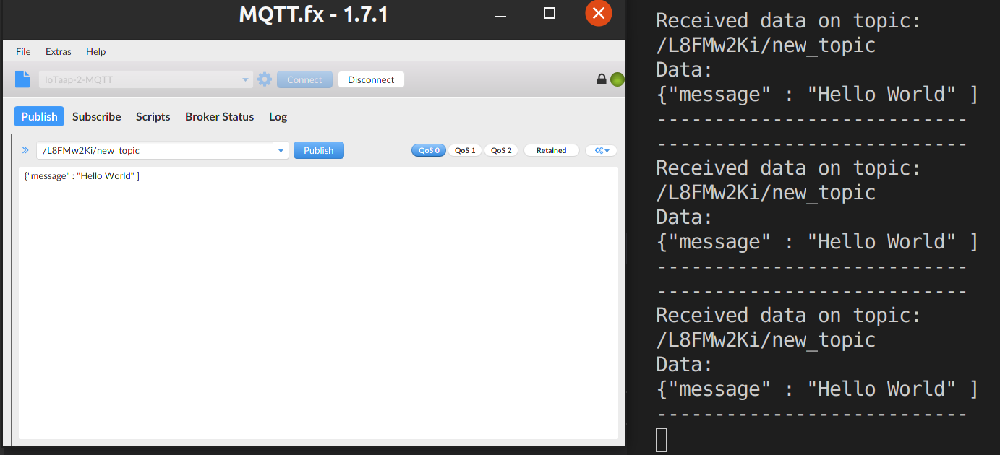

# Basic Examples

You will find an Initial example MQTT Code under the IoTaaP Library.

VSCode Folder Structure.

`PIO-> libdeps/IoTaaP-Magnolia/IoTaaP OS/ -> examples/initial_code `

This tutorial series breaks down this example and walks through the different MQTTS features of IoTaaP OS and how to use them.

## Subscribing To Topics & Receiving MQTT Messages

The simplest MQTT use case for IoTaaP OS is to connect to the wifi, subscribe to a MQTT topic and receive messages. 

The following example demonstrates this use case, in this tutorial we will break it down and explain how the different segments work.

```cpp
#include <IoTaaP_OS.h>

IoTaaP_OS iotaapOs("1.0.1");

void callback(char *topic, byte *message, unsigned int length)
{
  Serial.println("---------------------------");
  Serial.println("Received data on topic:");
  Serial.println(topic); // Print topic

  Serial.println("Data:");

  for (int i = 0; i < length; i++) // Print message
  {
    Serial.print((char)message[i]);
  }
  Serial.println();
  Serial.println("---------------------------");
}

void setup()
{
  iotaapOs.start(); // Start IoTaaP OS
  iotaapOs.startWifi(); // Connect to WiFi
  iotaapOs.startMqtt(callback); // Connect to MQTT broker
  iotaapOs.checkForUpdates(); // Manually check for updates at startup
  iotaapOs.basicSubscribe("new_topic"); // subscribe to topic
}

void loop()
{
  delay(500);
}
```
## Including IoTaaP_OS <span id="IoTaaP_OS"></span>
First we include the header file for the IoTaaP OS. This allows us to create an object of IoTaaP_OS Class. On the following line we do just this.

Note we give the object the parameter of `1.0.1` This is the version of the firmware. 

Knowing the version is key to the system later for OTA updates.

```cpp
#include <IoTaaP_OS.h>
IoTaaP_OS iotaapOs("1.0.1);
```
## Callback Function
Callback takes the received data from MQTT instance and prints the values to serial.
If we wanted to change the format of how we viewed the received data, we would change it in this function.

```cpp
void callback(char *topic, byte *message, unsigned int length)
{
  Serial.println("---------------------------");
  Serial.println("Received data on topic:");
  Serial.println(topic); // Print topic

  Serial.println("Data:");

  for (int i = 0; i < length; i++) // Print message
  {
    Serial.print((char)message[i]);
  }
  Serial.println();
  Serial.println("---------------------------");
}
```

## Setup Function
Setup is the configuration section, which runs at the start of the system, handling the connections to WiFi and MQTT Brokers, It is also suggested to trigger an OTA update check, this will compare the version given in [Including IoTaaP_OS](#IoTaaP_OS) against any firmware version uploaded to OTA update section on the IoTaaP Console. For more details see the separate [OTA tutorial.](https://docs.iotaap.io/docs-tutorials/iotaap-cloud-ota/)

```cpp
void setup()
{
  iotaapOs.start(); // Start IoTaaP OS
  iotaapOs.startWifi(); // Connect to WiFi
  iotaapOs.startMqtt(callback); // Connect to MQTT broker
  iotaapOs.checkForUpdates(); // Manually check for updates at startup
  iotaapOs.basicSubscribe(""new_topic"");
}
```

## Subscription
Subscription in MQTT is similar to subscribing to a newsletter in the real world. Effectively we are telling the MQTT instance we are interested in a specific topic and to send on any information about this topic, as soon as its published.

In this example we achieve this in the setup function, meaning for the entire runtime we are listening on the topic `new_topic` for any published messages.

```cpp
iotaapOs.basicSubscribe("new_topic");
```

## Loop
In this example there is no need add any additional information as we are just listening hence we can leave the loop empty. It is however generally good practise to add a delay within the main loop, as it allows the system a longer period to print any outputs handled behind the scenes during runtime.

```cpp
void loop()
{
  delay(1000); // optional delay
}
```

## Testing
It is highly suggested to test this we apply the methodology found under [IoTaaP Cloud - MQTTS](https://docs.iotaap.io/docs-tutorials/iotaap-cloud-mqtt/#testing-with-mqttfx).

Send a Publish Message to the topic `/<username>/new_topic` using MQTT FX client and check the serial monitor for an output.

The message should appear on screen similar to below.



If this is not the case, please re-read to make sure you have not missed any steps. If you still cannot solve the issue please ask for help at our support forum [found here](https://community.iotaap.io/c/support/6).


## Subscribing & Un-Subscribing

In the past example we subscribed to a topic in the setup(). This is fantastic if our use case requires to always be subscribed to a topic.

Alternative use cases may require changing topics subscripted to during runtime.

To achieve this we need to change the location of the subscription method from `setup() function`  to  `loop() function`.

```cpp
void setup()
{
  iotaapOs.start(); // Start IoTaaP OS
  iotaapOs.startWifi(); // Connect to WiFi
  iotaapOs.startMqtt(callback); // Connect to MQTT broker
  iotaapOs.checkForUpdates(); // Manually check for updates at startup
}

void loop()
{
  iotaapOs.basicSubscribe("new_topic");
  delay(500);
}
```
The result of this change is that now we are subscribing to `new_topic` on every iteration of the `loop()`
This supports the ability now to also unsubscribe during runtime, allowing us to stop listening from the MQTT instance on a specific topic.

```cpp
void setup()
{
  iotaapOs.start(); // Start IoTaaP OS
  iotaapOs.startWifi(); // Connect to WiFi
  iotaapOs.startMqtt(callback); // Connect to MQTT broker
  iotaapOs.checkForUpdates(); // Manually check for updates at startup
}

void loop()
{
  iotaapOs.basicSubscribe("new_topic"); //Listening now to new_topic
  delay(500);
  iotaapOs.basicUnsubscribe("new_topic"); //No longer listening to new_topic
  delay(500);
}
```

## Multiple Topics

IoTaaP MQTT supports as many topics as the hardware can handle, they can be subscribed to in parallel and receive on multiple topics at once.

```cpp
void setup()
{
  iotaapOs.start(); // Start IoTaaP OS
  iotaapOs.startWifi(); // Connect to WiFi
  iotaapOs.startMqtt(callback); // Connect to MQTT broker
  iotaapOs.checkForUpdates(); // Manually check for updates at startup
}

void loop()
{
  iotaapOs.basicSubscribe("new_topic"); //Listening now to new_topic
  iotaapOs.basicSubscribe("new_topic_1"); //Listening now to new_topic_1
  iotaapOs.basicSubscribe("new_topic_2");//Listening now to new_topic_2
  delay(500);
  iotaapOs.basicUnsubscribe("new_topic"); //No longer listening to new_topic
  iotaapOs.basicUnsubscribe("new_topic_1"); //No longer listening to new_topic_1
  iotaapOs.basicUnsubscribe("new_topic_2"); //No longer listening to new_topic_2
  delay(500);
}
```
